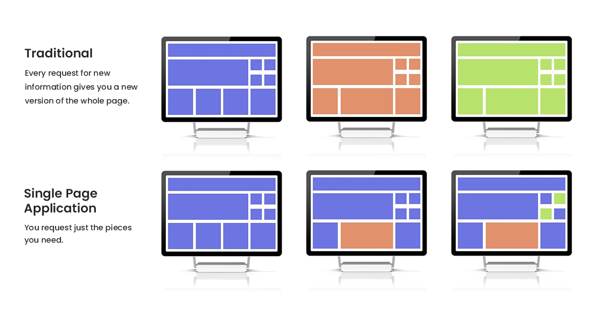

  

The easiest way to understand how the web works today is to walk through how it changed over time. Everything started with a world where the *server did all the thinking*. Whenever a user clicked something, the browser waited while the server rebuilt the entire page from zero and sent it back fully formed. This is the classic **Server-Side Rendering** era.. simple, predictable, but slow and not very interactive.

  

Things shifted when **React** showed up and said: “Let the browser handle it.” This was the beginning of **the SPA mindset** (*Single-Page Applications*). Instead of rebuilding whole pages, React loaded the app once and let JavaScript update everything on the fly. Navigation became instant and smooth, and the web finally felt like an app. But with that speed came two problems: the first load became heavy, and search engines couldn’t easily understand pages built entirely in the browser.

That’s when **Next.js** stepped in with a smarter idea: *pick the best rendering method per page*. Some pages could still be built on the server for fresh data, others could stay fully client-side for interactivity, and static pages could be prebuilt for performance. Next.js even added prefetching: quietly loading the next page before the user clicks it. This hybrid phase made the web feel faster and more reliable without losing the benefits of SPA-style interfaces.

  

But then a new realization hit the industry: websites were shipping way too much JavaScript. Even simple pages were dragging around huge bundles they didn’t need. This created a new wave of frameworks: Remix, SvelteKit, Nuxt, Astro. all built around **doing more with less JavaScript**. Astro especially pushed the idea that most pages don’t need JS at all unless a component is actually interactive.

This brings us to the newest chapter: **Islands and Partial Hydration**. Instead of waking up the entire page with JavaScript like React does, only the parts that truly need interactivity get activated. The rest stays fast, static, and cheap to render. It’s a small but powerful shift that dramatically improves performance, and frameworks like Astro, Qwik, and Fresh are leading this direction.

If you look at the whole story from top to bottom, it becomes one smooth timeline: first the server controlled everything, then the browser took over, then both shared the job, and now we’re in a phase where every piece of the page gets just the amount of JavaScript it truly needs.

and that's it, Chao
